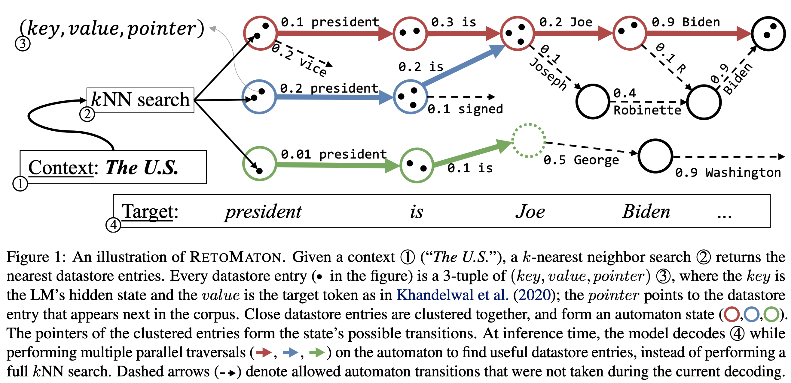

# RetoMaton: Neuro-Symbolic Language Modeling with Automaton-augmented Retrieval

A neuro-symbolic language model, based on a base neural-LM and an automaton that retrieves examples from the training data.
This is an official implementation of the model described in:

[Uri Alon](https://urialon.ml/), [Frank F. Xu](https://frankxfz.me/), [Junxian He](https://jxhe.github.io/), [Sudipta Sengupta](https://people.csail.mit.edu/sudipta/), [Dan Roth](https://www.cis.upenn.edu/~danroth/), and [Graham Neubig](http://www.phontron.com/), \
["Neuro-Symbolic Language Modeling with Automaton-augmented Retrieval"](https://arxiv.org/pdf/2201.12431.pdf)


_**May 2022**_ - 

_**April 2022**_ -  a talk **video** is available [here](https://www.youtube.com/watch?v=MOhWCb4cqjo)

This repository is a fork of the [kNN-LM](https://github.com/urvashik/knnlm) and based on the [fairseq](https://github.com/pytorch/fairseq) framework.

## Overview: (Figure 1 from [the paper](https://arxiv.org/pdf/2201.12431.pdf))
<center style="padding: 40px"></center>

## Results
*WikiText-103:*


*Law-MT, with a based LM that was trained on WMT News Crawl:*


*Law-MT, with a base LM that was fine-tuned on Law-MT:*

| Method      | ppl | ppl, saving 50% of the searches     |
| :---        |    ----:   |          ---: |
| Fine-tuned LM      | <td colspan=2>8.61          |
| kNN-LM      | 7.93        | 8.25    |
| AdaptRet baseline (He et al., 2021)   | 7.81        | 7.91    |
| RetoMaton (this work) | **7.10** |  **7.15**|


Table of Contents
=================
  * [Overview](#overview-figure-1-from-the-paper)
  * [Results](#results)
  * [Requirements](#requirements)
  * [Quickstart](#quickstart)
    * [Step 1: Preparing the data](#step-1-preparing-the-data)
    * [Step 2: Download the Base Language Model](#step-2-download-the-base-language-model)
    * [Step 3: Evaluating the Language Model](#step-3-evaluating-the-Language-Model)
    * [Step 4: Saving the keys and values for the datastore](#step-4-saving-the-keys-and-values-for-the-datastore)
    * [Step 5: Building the FAISS index](#step-5-building-the-faiss-index)
    * [Step 6: Evaluating RetoMaton without clustering](#step-6-evaluating-retomaton-without-clustering)
    * [Step 7: Adding clustering](#step-7-adding-clustering)
    * [Evaluating the Fine-tuned Model](#evaluating-the-fine-tuned-model)
  * [Lambda values](#lambda-values)
  * [Zenodo link](#zenodo-link)
  * [Differences from the kNN-LM implementation](#differences-from-the-knn-lm-implementation)
  * [Citation](#citation)

## Requirements
This repository is a fork of the [kNN-LM](https://github.com/urvashik/knnlm) and based on the [fairseq](https://github.com/pytorch/fairseq) framework.
### Dependencies
* This project is based on python3 and PyTorch 1.9.0. To check PyTorch version:
```python
python3 -c 'import torch; print(torch.__version__)
```

* The project also depends on the `faiss` library. We recommend using the GPU version of `faiss`:
```
pip install faiss-gpu
```
The CPU version can be installed using `pip install faiss`.

* Finally, from this project's directory, run:
```bash
pip install --editable .
```

### Hardware
Experiments for this paper were conducted on a machine that contains 16GB of RAM, and a single NVIDIA RTX 3090 GPU. 

Saving the Wikitext-103 datastore requires 200GB of disk space (in fp16, which does not degrade the performance compared to fp32).

## Quickstart

### Step 0: Clone this repository:
```bash
git clone https://github.com/urialon/retomaton
cd retomaton
```

### Step 1: Preparing the data

You can either download our preprocessed Wikitext-103 and Law-MT datasets, or preprocess them yourself.

#### Download the preprocessed Wikitext-103 dataset:
```bash
wget https://zenodo.org/api/files/8042535b-8f09-4fc2-b8cf-00b8e90af689/wiki103_preprocessed.tar.gz
tar -xzvf wiki103_preprocessed.tar.gz
```

#### Download the preprocessed Law-MT dataset:
```bash
wget https://zenodo.org/api/files/8042535b-8f09-4fc2-b8cf-00b8e90af689/law_preprocessed.tar.gz
tar -xzvf law_preprocessed.tar.gz
```

#### Preprocessing the dataset (not needed if you already downloaded our preprocessed dataset):

We share Fairseq's instructions on how to prepare the data here.

##### Preprocessing Wikitext-103:
```bash
cd examples/language_model/
bash prepare-wikitext-103.sh
cd ../..

TEXT=examples/language_model/wikitext-103
python preprocess.py \
    --only-source \
    --trainpref $TEXT/wiki.train.tokens \
    --validpref $TEXT/wiki.valid.tokens \
    --testpref $TEXT/wiki.test.tokens \
    --destdir data-bin/wikitext-103 \
    --workers 20
```

##### Preprocessing Law-MT:
The data is originally from: [https://github.com/roeeaharoni/unsupervised-domain-clusters](https://github.com/roeeaharoni/unsupervised-domain-clusters).
We used the `law/` subdirectory, and only the English "source" files.
Then, we re-tokenized the dataset using the model's BPE tokenizer.

The tokenized dataset can be downloaded from: 
```
wget https://zenodo.org/api/files/8042535b-8f09-4fc2-b8cf-00b8e90af689/law_tokenized.tar.gz
tar -xzvf law_tokenized.tar.gz
```

and then preprocessing it can be performed using:

```
TEXT=datasets/law
python preprocess.py \
    --only-source \
    --trainpref $TEXT/train.tokenized \
    --validpref $TEXT/dev.en.tokenized \
    --testpref $TEXT/test.en.tokenized \
    --destdir data-bin/law \
    --workers 20
```


### Step 2: Download the Base Language Model

The models that we used can be downloaded from the following sources:
For Wikitext-103:
```
wget https://nlp.stanford.edu/projects/knnlm/wt103_checkpoint_best.pt
```

For Law-MT:
```
wget https://dl.fbaipublicfiles.com/fairseq/models/lm/wmt19.en.tar.gz
tar -xzvf wmt19.en.tar.gz
```

We also share Fairseq's instructions on how to train the language model here:

```bash
python train.py --task language_modeling \
    data-bin/wikitext-103 \
    --save-dir checkpoints/ \
    --arch transformer_lm_wiki103 \
    --max-update 286000 --max-lr 1.0 --t-mult 2 --lr-period-updates 270000 --lr-scheduler cosine --lr-shrink 0.75 \
    --warmup-updates 16000 --warmup-init-lr 1e-07 --min-lr 1e-09 --optimizer nag --lr 0.0001 --clip-norm 0.1 \
    --criterion adaptive_loss --max-tokens 3072 --update-freq 3 --tokens-per-sample 3072 --seed 1 --fp16 \
    --sample-break-mode none --skip-invalid-size-inputs-valid-test --ddp-backend=no_c10d
```

This model was trained on 8 gpus.

### Step 3: Evaluating the Language Model

To evaluate the model on the validation set:

For Wikitext-103:
```bash
python eval_lm.py data-bin/wikitext-103 \
    --path checkpoints/wt103/wt103_checkpoint_best.pt \
    --sample-break-mode complete --max-tokens 3072 \
    --context-window 2560 --softmax-batch 1024 \
    --gen-subset valid
```

For Law-MT:
```bash
python eval_lm.py data-bin/law \
    --sample-break-mode eos \
    --path checkpoints/law/wmt19.en/model.pt \
    --max-tokens 2048 --context-window 0 \
    --gen-subset valid --remove-bpe
```

Notice that the main difference between the datasets is that in Law-MT we use the flags `--remove-bpe` and `--sample-break-mode eos`, and also the `--max-tokens` and `--context-window` values are different.

### Step 4: Saving the keys and values for the datastore

In order to save keys and values for the datastore, we must run model evaluation over the entire training set. 

#### For Wikitext-103:
**Caution**: Running this step requires 200GB of disk space 

```bash
python eval_lm.py data-bin/wikitext-103 \
    --path checkpoints/wt103/wt103_checkpoint_best.pt \
    --sample-break-mode none --max-tokens 3072 \
    --softmax-batch 1024 --gen-subset train \
    --context-window 1536 --tokens-per-sample 1536 \
    --dstore-mmap checkpoints/wt103/dstore16 --knn-keytype 'last_ffn_input' \
    --dstore-size 103225485 --model-overrides "{'knn_keytype': 'last_ffn_input'}" \
    --save-knnlm-dstore --fp16 --dstore-fp16
```

The total number of tokens in the Wikitext-103 training set is `103227021`. The dstore size `103225485` is `1536` tokens less than the total due to the context-window. We want each key to be constructed using a minimum amount of prior context.

#### For Law-MT:
Following the instructions and using the code of [https://github.com/jxhe/efficient-knnlm](https://github.com/jxhe/efficient-knnlm), we created the datastore using their code:
```
cd ../efficient-knnlm
python eval_lm.py ../retomaton/data-bin/law \
    --path ../retomaton/checkpoints/law/wmt19.en/model.pt \
    --sample-break-mode eos --max-tokens 2048 \
    --softmax-batch 1024 --gen-subset train \
    --context-window 0 --tokens-per-sample 512 \
    --dstore-mmap ../retomaton/checkpoints/law/dstore16 --knn-keytype 'last_ffn_input' \
    --dstore-size 19068709  \
    --log-interval 100 \
    --model-overrides "{'knn_keytype': 'last_ffn_input'}" \
    --fp16 --dstore-fp16 \
    --save-knnlm-dstore 
```

### Step 5: Building the FAISS index

The FAISS index requires a training stage where it learns an index for the keys. 
Once this is completed, the keys must all be added to the index. The speed of adding keys to the index depends on the hardware, particularly the amount of RAM available. 

For Wikitext-103:
```
DSTORE=checkpoints/wt103/dstore16
DSTORE_SIZE=103225485
INDEX=checkpoints/wt103/knn16.index
```

For Law-MT:
```
DSTORE=checkpoints/law/dstore16
DSTORE_SIZE=19068709
INDEX=checkpoints/law/knn16.index
```

and then for both datasets:
```bash
python build_dstore.py \
    --dstore_mmap ${DSTORE} \
    --dstore_size ${DSTORE_SIZE} \
    --faiss_index ${INDEX} \
    --num_keys_to_add_at_a_time 500000 \
    --starting_point 0
```


### Step 6: Evaluating RetoMaton without clustering

To evaluate the model on the validation set:

#### Wikitext-103:


```bash
DSTORE=checkpoints/wt103/dstore16
DSTORE_SIZE=103225485
INDEX=checkpoints/wt103/knn16.index
MODEL=checkpoints/wt103/wt103_checkpoint_best.pt

python eval_lm.py data-bin/wikitext-103 \
    --path ${MODEL} \
    --sample-break-mode complete --max-tokens 3072 \
    --context-window 2560 --softmax-batch 1024000 \
    --gen-subset valid --dstore-filename ${DSTORE} \
    --indexfile ${INDEX}  \
    --model-overrides "{'knn_keytype': 'last_ffn_input'}" \
    --k 1024 --lmbda 0.25 --dstore-size ${DSTORE_SIZE} --knn-keytype last_ffn_input \
    --probe 32 --knnlm --fp16 --dstore-fp16 \
    --knn-sim-func do_not_recomp_l2 --no-load-keys --move-dstore-to-mem \
    --knnlm-gpu --min-knns 1 --max-knns 1024 \
    --no-pointer
```

To encourage the model to perform a full kNN search more frequently and thus increase accuracy and reduce perplexity, use a larger value of `--min-knns` such as `100`. Using `--min-knns 9999999` makes the model perform kNN search at every step (`FoSS = 0` in Figure 3 of the paper), and achieves the best results at the cost of slower speed.

To run the baseline kNN-LM, remove the flag `--no-pointer`.

#### Law-MT:
```bash
DSTORE=checkpoints/law/dstore16
DSTORE_SIZE=19068709
INDEX=checkpoints/law/knn16.index
MODEL=checkpoints/law/wmt19.en/model.pt

python eval_lm.py data-bin/law \
    --path ${MODEL} \
    --sample-break-mode eos --max-tokens 2048 \
    --context-window 0 --softmax-batch 1024000 \
    --gen-subset valid --dstore-filename ${DSTORE} \
    --indexfile ${INDEX}  \
    --model-overrides "{'knn_keytype': 'last_ffn_input'}" \
    --k 1024 --lmbda 0.9 --dstore-size ${DSTORE_SIZE} --knn-keytype last_ffn_input \
    --probe 32 --knnlm --fp16 --dstore-fp16 \
    --knn-sim-func do_not_recomp_l2 --no-load-keys --move-dstore-to-mem \
    --remove-bpe \
    --knnlm-gpu --min-knns 1 --max-knns 1024 \
    --no-pointer
```

Notice that the difference betweens between the datasets is that in Law-MT we use the flags `--remove-bpe` and `--sample-break-mode eos`, and also the `--max-tokens` and `--context-window` values are different.
Further, as found by [He et al., 2021](), the interpolation coefficient should be set to `--lmbda 0.9`, to give more weight to the datastore than the base LM.

### Step 7: Adding clustering


## Evaluating the Fine-tuned Model
The model that was fine-tuned on Law-MT can be downloaded from:
```bash
wget https://zenodo.org/record/6525426/files/law_finetuned.pt
```

Then, the same steps as before should be run on the Law-MT datasets, except that the file `law_finetuned.pt` should be used as the checkpoint, rather than the file `checkpoints/law/wmt19.en/model.pt`.

**Note**: constructing RetoMaton on top of the fine-tuned model requires [saving the keys and values for the datastore again](#saving-the-keys-and-values-for-the-datastore) using the fine-tuned checkpoint, and then [building a new FAISS index](#building-the-faiss-index) using the fine-tuned checkpoint.

Finally, [evaluate](#evaluating-retomaton-without-clustering) using the fine-tuned checkpoint. 
**It is important** to also set `--lmbda 0.25` when using the fine-tuned model: since the model is fine-tuned, we can rely on it more than before. See a clarification at [#lambda-values](#lambda-values)

Best results with the fine-tuned model are achieved _without_ clustering (that is, every datastore entry is a singleton cluster).

## Lambda values
In all configurations, the interpolation factor `lmbda` is set to `0.25`, except when the base LM is `checkpoints/law/wmt19.en/model.pt` and the model is evaluated on Law-MT, since this scenario tests domain adaptation, and thus `lmbda` should be set to `0.9`.

## Zenodo link: 
Checkpoints and datasets can be downloaded from here:
[https://zenodo.org/record/6525426](https://zenodo.org/record/6525426)


## Differences from the kNN-LM implementation
* The original [kNN-LM](https://github.com/urvashik/knnlm) repository uses `faiss` CPU to perform retrieval. However, we added the flag `--knnlm-gpu` that allows performing retrieval much faster on the GPU.
* After each retrieval, the original [kNN-LM](https://github.com/urvashik/knnlm) repository loads the found keys and re-computes the distance from the query to each nearest neighbor. This is much more time consuming, unless loading all the keys (200GB) into memory.
We thus use the flags `--knn-sim-func do_not_recomp_l2 --no-load-keys --move-dstore-to-mem`.


## Citation

[Neuro-Symbolic Language Modeling with Automaton-augmented Retrieval](https://arxiv.org/pdf/2201.12431.pdf)

```
@article{alon2022neuro,
  title={Neuro-Symbolic Language Modeling with Automaton-augmented Retrieval},
  author={Alon, Uri and Xu, Frank F and He, Junxian and Sengupta, Sudipta and Roth, Dan and Neubig, Graham},
  journal={arXiv preprint arXiv:2201.12431},
  year={2022}
}
```